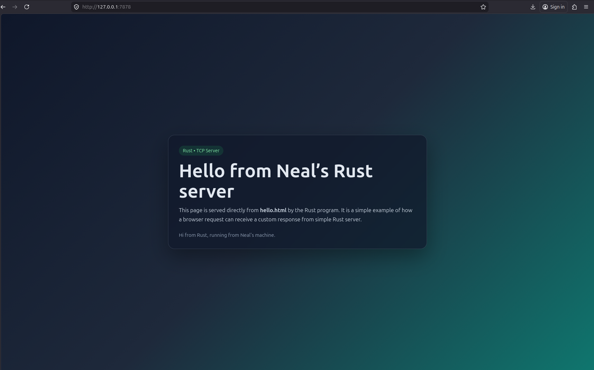

# Commit 1 Reflection Notes

**Nama:** Neal Guarddin  
**NPM:** 2406348282

## Reflection Notes

Pada tugas ini, saya mempelajari cara kerja server TCP sederhana di Rust melalui fungsi [`handle_connection`](src/main.rs). Berdasarkan dokumentasi Rust, `TcpStream` digunakan untuk merepresentasikan koneksi jaringan yang aktif, sedangkan `BufReader` membantu membaca data dari stream secara efisien baris demi baris.

### Isi utama dari `handle_connection`
- Fungsi menerima satu koneksi dari browser melalui `TcpStream`.
- Koneksi dibungkus dengan `BufReader` agar data request dapat dibaca sebagai teks.
- Method `.lines()` membaca request HTTP per baris.
- `.take_while(|line| !line.is_empty())` menghentikan pembacaan saat menemukan baris kosong, yang menandakan akhir header HTTP.
- Hasil request disimpan ke dalam `Vec<String>` lalu dicetak dengan `println!`.

### Pemahaman yang didapat
Browser mengirim HTTP request dalam bentuk teks yang berisi request line, header, dan baris kosong sebagai pemisah antara header dan body. Dengan membaca baris-baris tersebut, server dapat melihat isi request yang dikirim browser.

### Kesimpulan
Saya menjadi paham bahwa [`handle_connection`](src/main.rs) adalah bagian penting untuk menerima dan membaca request dari browser. Dari sini, saya belajar bagaimana komunikasi dasar HTTP bekerja pada server Rust sederhana.

# Commit 2 Reflection Notes

## Reflection Notes

Pada commit ini, saya memperbarui server Rust agar tidak hanya membaca request dari browser, tetapi juga mengirimkan respons HTML dari [hello.html](hello.html). Saya juga memahami lebih jelas isi dari [`handle_connection`](src/main.rs) di [src/main.rs](src/main.rs), yaitu menerima koneksi `TcpStream`, membaca request HTTP, lalu mengirim response ke browser.

### Yang saya pelajari
- [`handle_connection`](src/main.rs) menerima koneksi dari browser melalui `TcpStream`.
- `BufReader` digunakan untuk membaca request baris demi baris.
- `lines()` dipakai untuk mengambil isi request sebagai teks.
- `take_while(|line| !line.is_empty())` menghentikan pembacaan saat header HTTP selesai.
- File [hello.html](hello.html) dibaca dengan `fs::read_to_string`.
- Response dikirim dengan status line `HTTP/1.1 200 OK` dan header `Content-Length`.

### Hasil tampilan

### Kesimpulan
Saya jadi lebih paham bagaimana browser dan server berkomunikasi lewat HTTP request dan response. Dengan perubahan ini, server dapat menampilkan halaman HTML buatan sendiri secara langsung di browser.