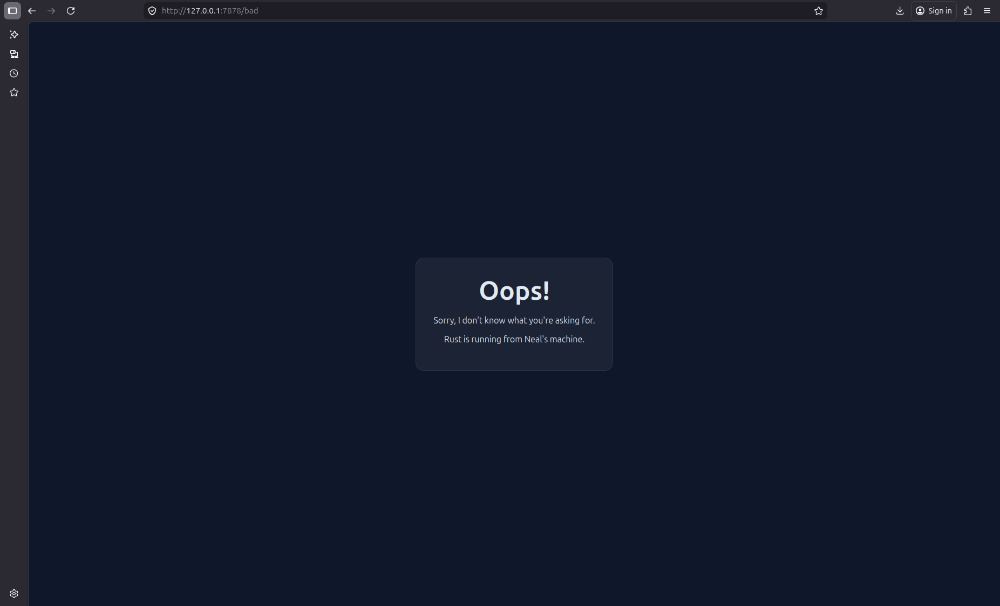

# Commit 1 Reflection Notes

**Nama:** Neal Guarddin  
**NPM:** 2406348282

## Reflection Notes

Pada tugas ini, saya mempelajari cara kerja server TCP sederhana di Rust melalui fungsi [`handle_connection`](src/main.rs). Berdasarkan dokumentasi Rust, `TcpStream` digunakan untuk merepresentasikan koneksi jaringan yang aktif, sedangkan `BufReader` membantu membaca data dari stream secara efisien baris demi baris.

### Isi utama dari `handle_connection`
- Fungsi menerima satu koneksi dari browser melalui `TcpStream`.
- Koneksi dibungkus dengan `BufReader` agar data request dapat dibaca sebagai teks.
- Method `.lines()` membaca request HTTP per baris.
- `.take_while(|line| !line.is_empty())` menghentikan pembacaan saat menemukan baris kosong, yang menandakan akhir header HTTP.
- Hasil request disimpan ke dalam `Vec<String>` lalu dicetak dengan `println!`.

### Pemahaman yang didapat
Browser mengirim HTTP request dalam bentuk teks yang berisi request line, header, dan baris kosong sebagai pemisah antara header dan body. Dengan membaca baris-baris tersebut, server dapat melihat isi request yang dikirim browser.

### Kesimpulan
Saya menjadi paham bahwa [`handle_connection`](src/main.rs) adalah bagian penting untuk menerima dan membaca request dari browser. Dari sini, saya belajar bagaimana komunikasi dasar HTTP bekerja pada server Rust sederhana.

# Commit 2 Reflection Notes

## Reflection Notes

Pada commit ini, saya memperbarui server Rust agar tidak hanya membaca request dari browser, tetapi juga mengirimkan respons HTML dari [hello.html](hello.html). Saya juga memahami lebih jelas isi dari [`handle_connection`](src/main.rs) di [src/main.rs](src/main.rs), yaitu menerima koneksi `TcpStream`, membaca request HTTP, lalu mengirim response ke browser.

### Yang saya pelajari
- [`handle_connection`](src/main.rs) menerima koneksi dari browser melalui `TcpStream`.
- `BufReader` digunakan untuk membaca request baris demi baris.
- `lines()` dipakai untuk mengambil isi request sebagai teks.
- `take_while(|line| !line.is_empty())` menghentikan pembacaan saat header HTTP selesai.
- File [hello.html](hello.html) dibaca dengan `fs::read_to_string`.
- Response dikirim dengan status line `HTTP/1.1 200 OK` dan header `Content-Length`.

### Hasil tampilan

### Kesimpulan
Saya jadi lebih paham bagaimana browser dan server berkomunikasi lewat HTTP request dan response. Dengan perubahan ini, server dapat menampilkan halaman HTML buatan sendiri secara langsung di browser. Selain itu, penempatan file dalam proyek juga sangat berpengaruh.

# Commit 3 Reflection Notes
## Reflection Notes

Pada milestone ini, saya memperbarui [`handle_connection`](src/main.rs) di [src/main.rs](src/main.rs) agar server dapat memvalidasi request dan memberi response yang berbeda sesuai path yang diminta browser.

### Yang saya pelajari
- [`handle_connection`](src/main.rs) membaca request line pertama dari browser.
- Request `GET / HTTP/1.1` diarahkan ke [hello.html](hello.html) dengan status `200 OK`.
- Request `GET /bad HTTP/1.1` diarahkan ke [404.html](404.html) dengan status `404 NOT FOUND`.
- Server sekarang tidak selalu mengirim halaman yang sama untuk semua request.
- Refactoring ini membuat server lebih realistis karena mampu membedakan halaman valid dan halaman tidak valid.

### Mengapa refactoring ini diperlukan
Sebelumnya server selalu mengirim [hello.html](hello.html) meskipun path yang diminta salah. Dengan validasi request, server bisa merespons secara selektif dan menampilkan halaman error yang sesuai ketika browser mengakses route yang tidak tersedia.

### Hasil tampilan

### Kesimpulan
Saya memahami bahwa validasi request adalah bagian penting dalam HTTP. Dengan membedakan response untuk `/` dan `/bad`, server Rust sederhana ini menjadi lebih sesuai dengan perilaku web server yang sebenarnya.

# Commit 4 Reflection Notes
## Reflection Notes

Pada milestone ini, saya mempelajari dampak server single-thread saat menangani request lambat. Perubahan pada [`handle_connection`](src/main.rs) di [src/main.rs](src/main.rs) menambahkan route `/sleep` yang membuat server menunggu beberapa detik sebelum mengirim response.

### Yang saya pelajari
- [`handle_connection`](src/main.rs) tetap membaca request dari browser seperti sebelumnya.
- Jika path yang diminta adalah `/sleep`, server menunda response selama beberapa detik.
- Selama proses itu berjalan, request lain ikut tertahan karena server masih memakai satu thread saja.
- Hal ini menunjukkan bahwa desain single-thread tidak cocok jika ada banyak user yang mengakses server secara bersamaan.
- Response untuk `/` tetap menampilkan [hello.html](hello.html), sedangkan request yang tidak dikenali tetap diarahkan ke [404.html](404.html).

### Mengapa ini penting
Simulasi ini membantu saya memahami bahwa server yang hanya berjalan pada satu thread akan menjadi lambat ketika ada request yang membutuhkan waktu lama. Jika ada banyak request bersamaan, request lain harus menunggu sampai proses sebelumnya selesai.

### Hasil tampilan

### Kesimpulan
Saya memahami bahwa penanganan request lambat perlu dipikirkan dengan baik dalam desain web server. Refactoring ke model yang lebih efisien, seperti multi-threading atau async, diperlukan agar server tetap responsif saat melayani banyak request. Apabila banyak user yang menggunakan dan seperti simulasi di atas memerlukan 10 detik sleep, maka akan mengurangi tingkat kepuasan user terhadap website.

# Commit 5 Reflection Notes
## Reflection Notes

Pada milestone ini, saya mempelajari bagaimana server **multithreaded** bekerja dengan bantuan [`ThreadPool`](src/lib.rs) di [src/lib.rs](src/lib.rs). Berdasarkan dokumentasi Rust pada bagian implementasi [`ThreadPool::execute`](src/lib.rs), thread pool digunakan untuk mengirim pekerjaan ke worker melalui channel, lalu worker akan mengeksekusi job tersebut secara paralel.

### Yang saya pelajari
- [`ThreadPool::new`](src/lib.rs) membuat sejumlah worker yang siap menerima tugas.
- [`ThreadPool::execute`](src/lib.rs) mengirim closure sebagai job ke channel.
- [`Worker::new`](src/lib.rs) membuat thread yang terus menunggu job dari queue.
- Di [src/main.rs](src/main.rs), `main` membuat [`ThreadPool`](src/lib.rs) dan mengirim [`handle_connection`](src/main.rs) ke pool untuk diproses.
- Dengan model ini, request yang lambat seperti `/sleep` tidak akan sepenuhnya memblokir request lain.

### Mengapa multithreaded server diperlukan
Sebelumnya server hanya memakai satu thread, sehingga request lambat membuat request lain ikut tertahan. Dengan thread pool, beberapa request **bisa diproses bersamaan oleh worker yang berbeda**. Ini membuat server lebih responsif dan lebih realistis untuk melayani banyak user.

### Kesimpulan
Saya memahami bahwa multithreading membantu server menangani request secara paralel. Implementasi [`ThreadPool::execute`](src/lib.rs) menjadi inti dari mekanisme ini karena memungkinkan server membagi pekerjaan ke worker yang tersedia.

# Bonus Reflection Notes
## Reflection Notes

Pada bonus ini, saya membuat fungsi [`hello::ThreadPool::build`](src/lib.rs) sebagai pengganti [`hello::ThreadPool::new`](src/lib.rs). Perubahan ini membuat inisialisasi thread pool lebih jelas dan tetap menjalankan fungsi yang sama seperti sebelumnya.

### Yang saya pelajari
- [`hello::ThreadPool::build`](src/lib.rs) digunakan untuk membuat thread pool dengan jumlah worker tertentu.
- Logika pembuatan worker tetap sama seperti pada [`hello::ThreadPool::new`](src/lib.rs).
- [`hello::ThreadPool::execute`](src/lib.rs) tetap dipakai untuk mengirim job ke worker.
- Di [src/main.rs](src/main.rs), server sekarang memanggil [`hello::ThreadPool::build`](src/lib.rs) saat membuat pool.

### Perbandingan
Secara fungsi, `build` dan `new` sama-sama membuat thread pool. Bedanya hanya pada nama **method**. Saya memahami bahwa pemilihan nama fungsi yang lebih sesuai bisa membuat kode lebih mudah dibaca dan lebih eksplisit dan ini kan sama saja gimmick dengan fungsi yang sudah ada, cuman yang kita buat bisa dibatasi. 

### Kesimpulan
Bonus ini membantu saya memahami refactoring kecil pada API internal program. Walaupun perilakunya sama, perubahan nama metode dapat meningkatkan kejelasan kode.